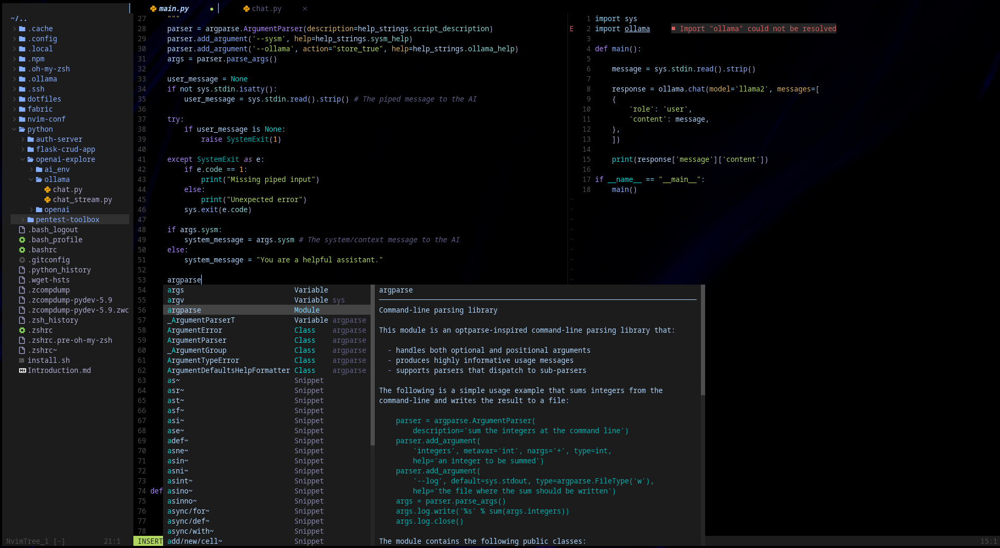

# nvim

## Description

Modified version of the awesomely organized and simple enough to understand for a beginner  with some removals and additions.

While there are setups to insteall Neovim configs with just a couple of commands and more or less a full fledged IDE will be configured with loads of plugins, my philosophy when moving into Neovim was to keep external code to a minimum and incrementally only add those absolutely necessary for a decently functional development environment.

Though progressively it has lead to 20 or so plugins for the setup to be where I want it to be - and still it's not even everything included in TinyVim, and supposedly even less than the likes of it's older sibling , or .

Still not sure vulnerability- or securitywise how comfortable I would be running it directly in my main machine, so it'll live in a containerized dev environment for the near future at least.

One of the nice things about this is how plugins can easily be added and removed by just commenting them out or pasted in from the plugin GitHub.

A few which I don't use are included in a commented state for even easier access if the need arises.

Thanks also to  for the Neovim inspiration, and mainlythanks to all the developers putting the time and effort in to create this.
